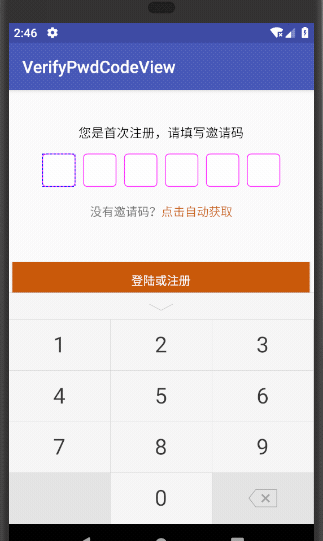

# VerifyPwdCodeView
Android 自定义方形输入框，带圆角输入框，虚线，普通矩形背景，支持阿拉伯国家输入格式，从右往左

## 效果图



---
## 用法

```
 <com.gyx.verifypwdcodeview.VerifyPwdCodeView
            android:id="@+id/password"
            android:layout_width="match_parent"
            android:layout_height="wrap_content"
            android:layout_marginLeft="35dp"
            android:layout_marginRight="35dp"
            android:layout_marginTop="10dp"
            app:autoCloseKeyBoard="true"
            app:bgFill="true"
            app:broderColor="#f0f"
            app:broderWidth="1dp"
            app:dottedColor="#00f"
            app:isCorner="true"
            app:isNeedDash="true"
            app:isPwd="false"
            app:numLength="6"
            app:rectChooseColor="#fff"
            app:rectNormalColor="#fff"
            app:rectStroke="1px"
            app:textColor="#000"
            app:txtSize="20sp"
            />
```

自定义属性

```
<declare-styleable name="VerifyPwdCodeView">
        <!--是否是密码-->
        <attr name="isPwd" format="boolean" />

        <!--配合密码模式，显示圆，还是*-->
        <attr name="pwdType" format="enum" >
            <enum name="CIRCLE" value="0"/>
            <enum name="XINGHAO" value="1"/>
        </attr>
        <!--是否自动关闭键盘-->
        <attr name="autoCloseKeyBoard" format="boolean" />=
        <!--每个输入框的，宽高占位-->
        <attr name="widthSpace" format="dimension" />
        <attr name="heightSpace" format="dimension" />
        <!--背景颜色画笔厚度-->
        <attr name="rectStroke" format="dimension" />
        <attr name="txtSize" format="dimension" />
        <!--密码模式圆直径-->
        <attr name="circleRadius" format="dimension" />
        <!--背景颜色是否填充-->
        <attr name="bgFill" format="boolean" />
        <attr name="numLength" format="integer" />
        <attr name="textColor" format="color" />
        <!--一般的颜色-->
        <attr name="rectNormalColor" format="color" />
        <!--选中的颜色-->
        <attr name="rectChooseColor" format="color" />
        <!--是否需要圆角-->
        <attr name="isCorner" format="boolean" />
        <!--圆角矩形颜色-->
        <attr name="broderColor" format="color" />
        <!--圆角矩形边框厚度-->
        <attr name="broderWidth" format="dimension" />
        <!--是否需要虚线-->
        <attr name="isNeedDash" format="boolean" />
        <!--虚线颜色-->
        <attr name="dottedColor" format="color" />
       
    </declare-styleable>


```


自定义键盘 借鉴
VirtualKeyboardView
```
 <com.lnyp.pswkeyboard.widget.VirtualKeyboardView
        android:id="@+id/virtualKeyboardView"
        android:layout_width="match_parent"
        android:layout_height="wrap_content"
        android:layout_gravity="bottom" />

```